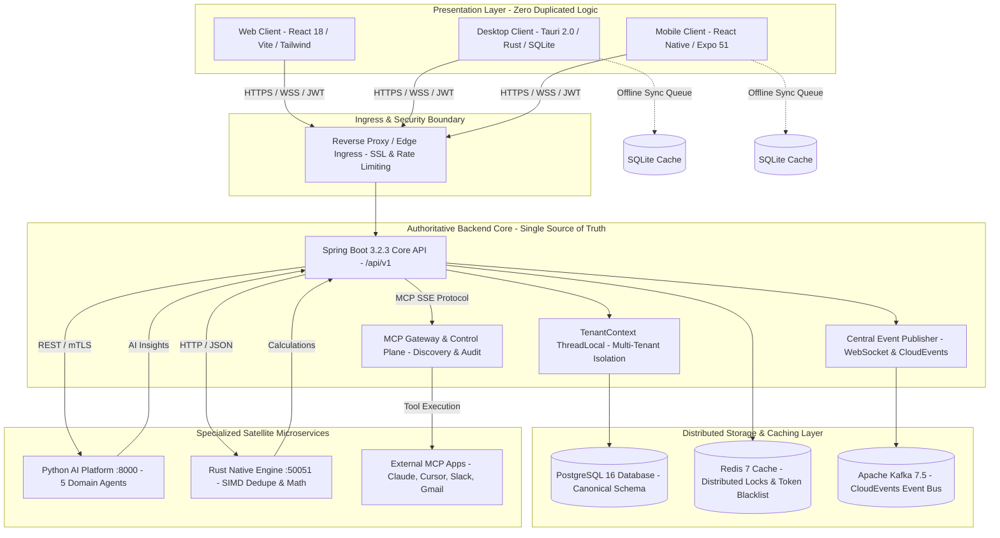

<div align="center">

# 🏛️ CRM OS — AI-Native Business Operating System
### Unified Commercial Architecture for Enterprise Web, Desktop & Mobile

[](LICENSE)
[](https://openjdk.org/)
[](https://spring.io/projects/spring-boot)
[](https://react.dev/)
[-FFC131?style=for-the-badge&logo=tauri&logoColor=black)](https://tauri.app/)
[](https://expo.dev/)
[](https://fastapi.tiangolo.com/)
[](https://www.rust-lang.org/)
[](https://www.postgresql.org/)
[](https://redis.io/)
[](https://kafka.apache.org/)
[](docs/CONTRIBUTING.md)

<br/>

**CRM OS** is an enterprise-grade, AI-native **Business Operating System** that unifies customer lifecycle management, autonomous AI agent meshes, Model Context Protocol (MCP) tool execution, and real-time event distribution into a single, cohesive ecosystem.

[🚀 Quickstart](#-getting-started--developer-onboarding) • [🏛️ Architecture Deep Dive](#-system-architecture) • [📚 Documentation Hub](#-documentation-matrix--deep-dive-guides) • [📡 API Reference](#-centralized-api-reference-apiv1) • [🔐 Demo Accounts](#-default-seed-credentials--tenants) • [📄 License](#-license--governance)

</div>

---

## 💡 Executive Summary & System Vision

Traditional CRMs are passive, siloed CRUD record-stores: sales reps manually enter data, managers export stale reports, and automated workflows require brittle, multi-vendor integrations.

**CRM OS** re-architects enterprise commercial operations as an **operational nervous system**:
* **Single Central Source of Truth**: Eliminates multi-client data divergence by consolidating Web, Desktop, and Mobile clients around **ONE authoritative Spring Boot 3.2.3 backend API** (`/api/v1`).
* **Autonomous Multi-Agent Mesh**: An isolated Python satellite (`services/ai-service`) hosts five specialized domain agents (Sales Strategist, Support Concierge, Campaign Architect, Revenue Analyst, Market Intel) governed by shadow mode approvals and PII redaction.
* **Native Model Context Protocol (MCP)**: Native MCP Server and Gateway exposing CRM context and tools safely to external LLMs (Claude Desktop, Cursor, Custom Agents) and external SaaS platforms (Slack, Gmail, GitHub, Jira).
* **Native Performance Acceleration**: An ultra-low latency Rust microservice (`services/performance-engine`) handles SIMD-accelerated deduplication and Monte Carlo pipeline revenue simulations.
* **Offline-First Synchronization**: Desktop (Tauri) and Mobile (Expo) clients operate with zero downtime, queuing mutations locally in SQLite and synchronizing atomically via batch endpoints upon network restoration.
* **Zero-Trust Multi-Tenant Isolation**: Request-scoped `TenantContext` ThreadLocal guarantees strict mathematical database separation across enterprise organizations.

---

## 🧭 Touch-Friendly Quick Navigation Hub

Tap or click any section below for immediate navigation:

| Section | Description | Direct Link |
| :--- | :--- | :--- |
| 🏛️ **System Architecture** | Multi-tier topology, Mermaid diagrams & Seven Invariants | [Jump to Architecture](#-system-architecture) |
| 📚 **Documentation Hub** | Touch-friendly matrix linking all 18 technical specifications | [Jump to Docs Hub](#-documentation-matrix--deep-dive-guides) |
| 🚀 **Developer Quickstart** | 1-Command Docker setup & local development guides | [Jump to Quickstart](#-getting-started--developer-onboarding) |
| 🔐 **Demo Credentials** | Default pre-seeded admin, manager, and sales agent accounts | [Jump to Credentials](#-default-seed-credentials--tenants) |
| 📡 **API & WebSocket Catalog**| REST endpoints (`/api/v1`) & STOMP event bus topics | [Jump to API Reference](#-centralized-api-reference-apiv1) |
| 🛠️ **Developer Scripts** | Windows PowerShell & Unix automation tools | [Jump to Scripts](#-developer-automation-scripts) |
| ⚙️ **Configuration Matrix** | Environment variables for backend, clients, and datastores | [Jump to Config](#-environment-variables-configuration) |
| 📄 **License & Governance** | Official Apache License 2.0 terms & commercial usage | [Jump to License](#-license--governance) |

---

## 🏛️ System Architecture

CRM OS is designed according to modern distributed systems principles: high cohesion, loose coupling, stateless compute, and centralized authority.

### 360° Visual Component Topology



---

### High-Level Architectural Schematics

```text
                                    CLIENT LAYER
         ┌───────────────────┬───────────────────┬───────────────────┐
         │  Web Application  │  Desktop Client   │    Mobile Apps    │
         │  (React 18 / Vite)│  (Tauri 2 / Rust) │ (Android / iOS)   │
         └─────────┬─────────┴─────────┬─────────┴─────────┬─────────┘
                   │                   │                   │
                   └───────────────────┼───────────────────┘
                                       │ HTTPS / WSS / JWT
                                       ▼
                         ┌───────────────────────────┐
                         │   Edge & Ingress Gateway  │
                         │ Rate Limit • SSL • Helmet │
                         └─────────────┬─────────────┘
                                       │
                                       ▼
     ═════════════════════════════════════════════════════════════════════════
                          PRIMARY BACKEND CORE (Java 17)
                          Spring Boot 3.2.3 Ecosystem
     ─────────────────────────────────────────────────────────────────────────
      • Core CRM (Customers, Leads, Deals, Contacts, Tasks, Invoices)
      • Unified Identity & Sessions (Passkeys / WebAuthn, OAuth 2.0, SAML)
      • MCP Server & Gateway (Tool Discovery, Consent, Policy Enforcement)
      • Developer Platform (API Keys, Webhook Subscriptions & Deliveries)
      • Action Approval Center (Human-in-the-loop Shadow Mode)
      • Central Event Publisher (WebSocket STOMP + Kafka Event Bus)
     ═════════════════════════════════════════════════════════════════════════
              │                        │                        │
       JPA / Flyway             Redis Protocol             CloudEvents
              │                        │                        │
              ▼                        ▼                        ▼
     ┌──────────────────┐     ┌──────────────────┐     ┌──────────────────┐
     │  Relational DB   │     │  Redis 7 Cluster │     │   Apache Kafka   │
     │ PostgreSQL 16 /  │     │ Caching • Locks  │     │ Async Event Bus  │
     │     MySQL 8      │     │ Revocation Black │     │ Event Streaming  │
     └──────────────────┘     └──────────────────┘     └────────┬─────────┘
                                                                │
                                           ┌────────────────────┴───────────┐
                                           ▼                                ▼
                                ┌────────────────────┐           ┌────────────────────┐
                                │ PYTHON AI PLATFORM │           │ PERFORMANCE ENGINE │
                                │ FastAPI / PyTorch  │           │ Rust SIMD Dedupe   │
                                │ 5 Domain Agents    │           │ Monte Carlo Math   │
                                │ "Ask My CRM" SQL   │           │ Low-Latency Worker │
                                └─────────┬──────────┘           └────────────────────┘
                                          │ Tool Invocations
                                          ▼
                                ┌────────────────────┐
                                │ MCP CONNECTED APPS │
                                │ Gmail • Calendar   │
                                │ Slack • GitHub     │
                                └────────────────────┘
```

---

### The Six Enterprise Architecture Layers

```
Layer 1: Multi-Client Presentation (React 18, Tauri 2.0, Expo SDK 51)
Layer 2: Edge Ingress & Security Filter Chain (JWT, CORS, Rate Limits)
Layer 3: Single Centralized Core Engine (Spring Boot 3.2.3 / Java 17)
Layer 4: AI Platform & Multi-Agent Mesh (Python FastAPI / PyTorch / LangChain)
Layer 5: Native Performance Engine (Rust Axum / Tokio / Rayon)
Layer 6: Distributed Persistence, Cache & Event Bus (PostgreSQL, Redis, Kafka)
```

#### 1. Multi-Client Presentation Layer
* **Web Client (`apps/web`)**: Modern React 18 SPA built with Vite 5, Tailwind CSS, TanStack Query 5, TanStack Table 8, Lucide icons, and Framer Motion fluid animations.
* **Desktop Client (`apps/desktop`)**: Cross-platform desktop application built with Tauri 2.0 (Rust native host) and React frontend, providing desktop system tray, native notifications, and a local SQLite cache.
* **Mobile Client (`apps/mobile`)**: Universal native iOS and Android application built on Expo SDK 51, Expo Router 3, Reanimated 3, and Expo SQLite for offline mutation queuing.

#### 2. Edge Ingress & Security Gateway
* Central entry point terminating TLS 1.3, managing Cross-Origin Resource Sharing (CORS), filtering malicious payloads, and enforcing per-IP / per-token sliding-window rate limits.

#### 3. Single Centralized Core Engine
* Built with **Spring Boot 3.2.3** and **Java 17/21 LTS**.
* Implements the **Zero Client Duplication Invariant**: all validations, business calculations, permissions, and database interactions are owned strictly here.
* ThreadLocal `TenantContext` automatically isolates all database queries by `organization_id`.

#### 4. Python AI Satellite Service (`services/ai-service`)
* Powered by **FastAPI**, **PyTorch**, and **LangChain**.
* Hosts the **Autonomous Multi-Agent Mesh**:
  1. 🎯 *Sales Strategist Agent*: Deal win probability, objection handling, and pricing recommendations.
  2. 💬 *Support Concierge Agent*: Automated ticket triage, response drafting, and SLA escalation.
  3. 📢 *Campaign Architect Agent*: Email generation, customer segment targeting, and copy optimization.
  4. 📊 *Revenue Analyst Agent*: ARR/MRR trend detection, churn warnings, and pipeline velocity metrics.
  5. 🔍 *Market Intel Agent*: Competitor profiling and executive briefing syntheses.
* Includes an **AI Context Firewall** (PII redaction and minimization), **Multi-Model Router** (OpenAI, Claude, Gemini, local Ollama), and **"Ask My CRM"** (read-only NL-to-SQL engine).

#### 5. Native Performance Engine (`services/performance-engine`)
* Written in **Rust 1.75+** utilizing **Axum**, **Tokio**, and **Rayon**.
* Delivers ultra-low latency compute for vector deduplication (SIMD-accelerated Levenshtein / Jaro-Winkler distances) and 10,000-iteration Monte Carlo revenue pipeline forecasting.

#### 6. Distributed Persistence, Caching & Messaging
* **PostgreSQL 16**: Central ACID relational database governed by automated Flyway migrations (`V1` to `V5`).
* **Redis 7**: High-performance in-memory cache, distributed locks, session store, and JWT revocation blacklist.
* **Apache Kafka 7.5**: Distributed event bus for asynchronous event sourcing, audit log fan-out, and webhooks.
* **SQLite (Client-Side)**: Local offline storage on desktop and mobile clients for queuing mutations when offline.

---

### The Seven System Invariants

Every subsystem and contribution in CRM OS adheres to these seven foundational invariants:

| # | System Invariant | Architectural Meaning | Enforcement Mechanism |
| :---: | :--- | :--- | :--- |
| **1** | **One Centralized Backend** | Spring Boot 3.2 on `/api/v1` is the only authoritative system of record. | Zero duplicated business logic on clients |
| **2** | **One Source of Truth** | Central Relational DB (PostgreSQL 16) owns all canonical state. | Foreign keys, constraints & Flyway migrations |
| **3** | **One Identity System** | Central IAM for Passkeys (WebAuthn), OAuth 2.0, and JWTs. | Unified `SecurityFilterChain` & BCrypt/Argon2 |
| **4** | **One Authorization Model** | Unified RBAC + ABAC enforced at service and method layers. | `@PreAuthorize` & request-scoped `TenantContext` |
| **5** | **One Audit Platform** | Immutable, append-only audit trail across DB, AI, and MCP tools. | `audit_logs` and `mcp_audit_logs` tables |
| **6** | **One Data Platform** | Synchronized transactional state with cache-invalidation hooks. | Redis cache eviction on JPA entity lifecycle events |
| **7** | **One Event Architecture** | CloudEvents-compliant asynchronous streaming bus. | Kafka topics & WebSocket STOMP real-time pub/sub |

---

## 📚 Documentation Matrix & Deep Dive Guides

The platform includes exhaustive technical specifications in the [`docs/`](docs/) directory. Click or touch any document below for deep-dive specifications:

### 🏛️ Core Architecture & Design
* 📖 **[Master Enterprise Architecture Specification](docs/ARCHITECTURE.md)** — Comprehensive architecture blueprint, six-layer breakdown, and cross-cutting concerns.
* 🔍 **[High-Level Architecture Overview](docs/architecture/overview.md)** — Architectural summary, client responsibility matrix, and domain boundaries.
* 🖥️ **[UI & Multi-Client Architecture](docs/UI_ARCHITECTURE.md)** — Presentation layer design, state management, and offline cache boundaries.
* 🎨 **[Design System & Component Tokens](docs/DESIGN_SYSTEM.md)** — Color palettes, typography, spacing scales, and reusable component patterns.

### 📡 API, Events & Integration
* 📡 **[Master REST & WebSocket API Specification](docs/API.md)** — Standard request envelopes, pagination standards, and comprehensive endpoint catalog.
* 🔌 **[Model Context Protocol (MCP) Guide](docs/MCP_ARCHITECTURE.md)** — CRM MCP Server, external MCP client connectors, tool schemas, and safety guards.
* 📨 **[Event Bus & Messaging Architecture](docs/EVENTS.md)** — CloudEvents standards, Kafka topic topologies, and WebSocket STOMP real-time channels.

### 🤖 Intelligence & Performance
* 🧠 **[AI Platform & Multi-Agent Mesh](docs/AI_ARCHITECTURE.md)** — 5 domain agents, AI Context Firewall, Multi-Model Router, and "Ask My CRM" RAG.
* ⚡ **[Rust Native Performance Engine](docs/PERFORMANCE.md)** — SIMD vector deduplication algorithms, Monte Carlo math, and latency benchmarks.

### 🔒 Security, Database & Infrastructure
* 🔒 **[Security, IAM & Compliance Specification](docs/SECURITY.md)** — Dual-token JWT flow, Passkeys / WebAuthn, RBAC matrix, and OWASP compliance.
* 💾 **[Database & Persistence Strategy](docs/DATABASE.md)** — Dual-engine portability (Postgres/MySQL), Flyway migration lifecycle, and Redis caching topologies.
* 🚢 **[Deployment & Infrastructure Guide](docs/DEPLOYMENT.md)** — Docker Compose configuration, Kubernetes Helm charts, and cloud production topology.

### 📋 Quality, Standards & Operations
* 🚀 **[Developer Onboarding & Getting Started Guide](docs/GETTING_STARTED.md)** — Step-by-step workstation setup, prerequisites, and service execution.
* 🤝 **[Engineering Contribution Guidelines](docs/CONTRIBUTING.md)** — Branching strategy, Conventional Commits, code standards, and PR checklist.
* 🧪 **[Testing Strategy & Quality Assurance](docs/TESTING.md)** — Unit, integration, E2E, and contract testing requirements.
* ♿ **[Accessibility Standards (WCAG 2.1 AA)](docs/ACCESSIBILITY.md)** — ARIA patterns, keyboard navigation, and contrast compliance.
* 🎬 **[Motion & Micro-Interaction Guidelines](docs/MOTION_GUIDELINES.md)** — Framer Motion easing curves, duration tokens, and animation standards.
* 👥 **[UX & Interaction Principles](docs/UX_GUIDELINES.md)** — Enterprise usability, form layouts, error recovery, and cognitive load reduction.
* ✍️ **[Content & Microcopy Guidelines](docs/CONTENT_GUIDELINES.md)** — Voice, tone, error messaging, and terminology rules.

---

## 🚀 Getting Started & Developer Onboarding

### 1. Prerequisites Checklist
Ensure your workstation has the following tools installed:
* **Java**: JDK 17 or 21 LTS (`java -version`)
* **Node.js**: v18.0.0+ (v20 LTS recommended, `node -v`)
* **Docker & Docker Compose**: Engine 24+ (`docker compose version`)
* **Python**: 3.10 or 3.11 (`python --version`)
* **Rust & Cargo**: 1.75+ (`cargo --version`)

For detailed installation instructions, see the **[Developer Onboarding Guide](docs/GETTING_STARTED.md)**.

---

### 2. Fast Launch via Docker Compose (Recommended)

Launch the entire ecosystem with a single command:

```bash
# Clone the repository
git clone https://github.com/your-org/crm-platform.git
cd crm-platform

# Start all infrastructure and satellite services
docker compose up -d

# Verify all containers are running and healthy
docker compose ps
```

#### Active Service Endpoints
| Component | Local URL / Port | Technology | Health Check Endpoint |
| :--- | :--- | :--- | :--- |
| **Backend REST API** | `http://localhost:8080/api/v1` | Spring Boot 3.2.3 | `http://localhost:8080/actuator/health` |
| **Swagger / OpenAPI** | `http://localhost:8080/swagger-ui.html` | SpringDoc OpenAPI | Browser interface |
| **Python AI Satellite** | `http://localhost:8000` | FastAPI / PyTorch | `http://localhost:8000/health` |
| **Performance Engine** | `http://localhost:50051` | Rust Axum | HTTP status `200` |
| **PostgreSQL Database** | `localhost:5432` | PostgreSQL 16 | `pg_isready -U crm_user` |
| **Redis Cache** | `localhost:6379` | Redis 7 | `redis-cli ping` |
| **Kafka Event Broker** | `localhost:9092` | Apache Kafka 7.5 | TCP Socket |

---

### 3. Running Services Locally for Active Development

If modifying code, run databases in Docker and start applications on your host machine:

#### Step 1: Start Database & Redis
```bash
docker compose up -d postgres redis
```

#### Step 2: Start Spring Boot Core Backend
```bash
cd backend

# On macOS / Linux:
./mvnw spring-boot:run

# On Windows:
.\mvnw.cmd spring-boot:run
```
API launches at `http://localhost:8080/api/v1`.

#### Step 3: Start Web Client
```bash
cd apps/web
npm install
npm run dev
```
Web application launches at `http://localhost:5173`.

#### Step 4: Start Desktop Client (Tauri)
```bash
cd apps/desktop
npm install
npm run tauri dev
```

#### Step 5: Start Mobile Client (Expo)
```bash
cd apps/mobile
npm install
npx expo start
```
Press `a` for Android Emulator, `i` for iOS Simulator, or scan the QR code via Expo Go.

---

## 🔐 Default Seed Credentials & Tenants

The database is pre-populated via Flyway migrations (`V1` to `V5`) and seed script (`V2__seed_data.sql`):

| Email Address | Default Password | Role | Organization Tenant | Primary Capabilities |
| :--- | :--- | :--- | :--- | :--- |
| `admin@nexus.com` | `password123` | `ADMIN` | Acme Corp (`org-demo-1`) | Organization settings, user provisioning, security audit logs |
| `manager@nexus.com` | `password123` | `MANAGER` | Acme Corp (`org-demo-1`) | Pipeline forecasting, team approvals, analytics dashboards |
| `agent@nexus.com` | `password123` | `SALES_AGENT` | Acme Corp (`org-demo-1`) | Leads, Deals (Kanban), Contacts, Tasks, Communications |

---

## 📡 Centralized API Reference (`/api/v1`)

All client applications communicate exclusively with these centralized REST endpoints:

| Domain Module | Base Path | Key Methods & Capabilities | Documentation |
| :--- | :--- | :--- | :--- |
| **Identity & Auth** | `/api/v1/auth` | `POST /login`, `POST /register`, `POST /refresh`, `POST /logout` | [API Spec](docs/API.md#31-authentication--identity-apiv1auth) |
| **Passkeys / WebAuthn**| `/api/v1/auth/passkeys` | Registration and assertion challenges for biometric login | [Security Spec](docs/SECURITY.md) |
| **Sales Leads** | `/api/v1/leads` | CRUD, lead scoring, status filtering, conversion to Deal/Contact | [API Spec](docs/API.md#32-leads-management-apiv1leads) |
| **Deals & Pipeline**| `/api/v1/deals` | Full CRUD, Kanban pipeline stages, probability calculation | [API Spec](docs/API.md#33-deals--pipeline-apiv1deals) |
| **Contacts & Orgs** | `/api/v1/contacts` | Contact directory, multi-company associations, activity links | [API Spec](docs/API.md) |
| **Companies** | `/api/v1/companies` | Corporate accounts, domain tracking, address records | [API Spec](docs/API.md) |
| **Tasks & Calendar** | `/api/v1/tasks` | Task creation, assignment, priority levels, completion toggles | [API Spec](docs/API.md) |
| **Activities & Audit**| `/api/v1/activities` | Centralized customer interaction timeline and audit records | [API Spec](docs/API.md) |
| **Products & Catalog**| `/api/v1/products` | Commercial product catalog, SKU management, unit pricing | [API Spec](docs/API.md) |
| **Invoices & Orders** | `/api/v1/invoices` | Billing generation, status management, payment tracking | [API Spec](docs/API.md) |
| **Executive Reports** | `/api/v1/reports` | KPI summaries, win rates, revenue forecasts, pipeline health | [API Spec](docs/API.md) |
| **Offline Batch Sync**| `/api/v1/sync/batch` | Atomic sync endpoint for client offline mutation queues | [Architecture Spec](docs/ARCHITECTURE.md) |
| **MCP Tools** | `/api/v1/mcp` | Discovery (`GET /tools`), execution (`POST /execute`), tool audit | [MCP Spec](docs/MCP_ARCHITECTURE.md) |
| **AI Intelligence** | `/api/v1/ai` | Copilot querying, PII-sanitized prompts, "Ask My CRM" SQL | [AI Spec](docs/AI_ARCHITECTURE.md) |
| **WebSocket Events** | `/api/v1/ws` | STOMP broker broadcasting on `/topic/events`, `/topic/deals` | [Events Spec](docs/EVENTS.md) |

---

## 🛠️ Developer Automation Scripts

The repository provides automated cross-platform scripts inside the [`scripts/`](scripts/) directory:

| Script Path | Platform | Operational Purpose | Execution Command |
| :--- | :--- | :--- | :--- |
| `scripts/build-all.ps1` | Windows | Compiles backend JAR and runs production builds for Web & Desktop | `powershell -ExecutionPolicy Bypass -File .\scripts\build-all.ps1` |
| `scripts/build-all.sh` | Unix / macOS | Production build pipeline for all platform components | `./scripts/build-all.sh` |
| `scripts/test-all.ps1` | Windows | Executes backend unit/integration tests against in-memory H2 DB | `powershell -ExecutionPolicy Bypass -File .\scripts\test-all.ps1` |
| `scripts/test-all.sh` | Unix / macOS | Comprehensive automated test suite runner | `./scripts/test-all.sh` |
| `scripts/dev-all.ps1` | Windows | Interactive multi-service development launcher | `powershell -ExecutionPolicy Bypass -File .\scripts\dev-all.ps1` |
| `scripts/migrate-db.ps1`| Windows | Applies pending Flyway schema and seed migrations to PostgreSQL | `powershell -ExecutionPolicy Bypass -File .\scripts\migrate-db.ps1` |

---

## ⚙️ Environment Variables Configuration

The platform is configured via environment variables. See [`.env.example`](.env.example) for baseline templates:

| Environment Variable | Target Service | Default Value | Description |
| :--- | :--- | :--- | :--- |
| `PORT` / `SERVER_PORT` | Backend | `8080` | Spring Boot HTTP listening port |
| `DATABASE_URL` | Backend | `jdbc:postgresql://localhost:5432/crm_db` | Relational database JDBC connection URL |
| `DATABASE_USERNAME` | Backend | `crm_user` | Database authentication username |
| `DATABASE_PASSWORD` | Backend | `crm_password` | Database authentication password |
| `REDIS_HOST` | Backend | `localhost` | Redis server hostname |
| `REDIS_PORT` | Backend | `6379` | Redis server port |
| `KAFKA_BOOTSTRAP_SERVERS`| Backend | `localhost:9092` | Apache Kafka broker connection address |
| `JWT_SECRET` | Backend | `404E635266556A586E327235753878...` | 256-bit cryptographic secret for signing JWTs |
| `CRM_AI_SERVICE_URL` | Backend | `http://localhost:8000` | Python AI Satellite service base URL |
| `CRM_PERFORMANCE_SERVICE_URL`| Backend | `http://localhost:50051` | Rust native performance engine base URL |
| `VITE_API_URL` | Web & Desktop | `http://localhost:8080/api/v1` | Central REST API URL for frontend clients |
| `EXPO_PUBLIC_API_URL` | Mobile | `http://localhost:8080/api/v1` | Central REST API URL for mobile app |

---

## 📄 License & Governance

CRM OS is open-source software released under the **[Apache License, Version 2.0](LICENSE)**.

```
Copyright 2026 CRM OS Platform Contributors

Licensed under the Apache License, Version 2.0 (the "License");
you may not use this file except in compliance with the License.
You may obtain a copy of the License at

    http://www.apache.org/licenses/LICENSE-2.0

Unless required by applicable law or agreed to in writing, software
distributed under the License is distributed on an "AS IS" BASIS,
WITHOUT WARRANTIES OR CONDITIONS OF ANY KIND, either express or implied.
See the License for the specific language governing permissions and
limitations under the License.
```

### Commercial Usage & Contributions
* Commercial deployment and private modifications are fully permitted under Apache 2.0 terms.
* All contributions are welcomed and must adhere to our **[Engineering Contribution Guidelines](docs/CONTRIBUTING.md)**.
* Security vulnerabilities should be reported following the protocol outlined in our **[Security Specification](docs/SECURITY.md)**.

---

<div align="center">

**Built with pride for high-velocity enterprise teams.**<br/>
[Back to Top ⬆️](#-crm-os--ai-native-business-operating-system)

</div>
