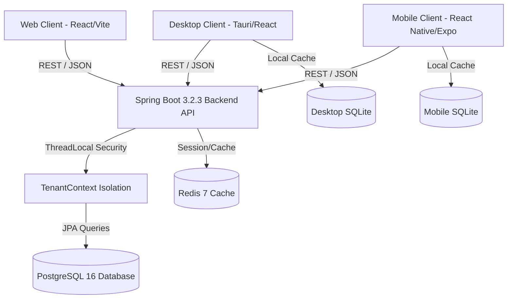

# Unified CRM Architecture Specification

## 1. System Overview
The CRM platform adopts a **Single Backend, Multi-Client Architecture**. All domain logic, authentication, multi-tenancy rules, data validations, workflow automation, and reporting metrics are owned exclusively by the central Spring Boot backend (`/backend`).

---

## 2. Shared Domain Modules

1. **Authentication & Identity (`com.crm.auth`)**: Registration, JWT Login, Refresh Token Rotation, User Self-Context.
2. **Tenant Isolation (`com.crm.organization` & `com.crm.security`)**: ThreadLocal tenant binder filtering all queries by `organization_id`.
3. **Leads Management (`com.crm.lead`)**: CRUD, lead scoring, status lifecycle, lead-to-deal conversion.
4. **Deals & Pipeline (`com.crm.deal`)**: Kanban stages (`NEW`, `QUALIFIED`, `DEMO`, `PROPOSAL`, `NEGOTIATION`, `WON`, `LOST`), probability & revenue forecasting.
5. **Contacts & Companies (`com.crm.contact`, `com.crm.company`)**: Business directory records.
6. **Tasks & Calendar (`com.crm.task`)**: Priorities (`LOW`, `MEDIUM`, `HIGH`, `URGENT`), due dates, status updates.
7. **Activities & Audit (`com.crm.activity`, `com.crm.audit`)**: Event timeline logging and security compliance.
8. **Products & Invoices (`com.crm.product`, `com.crm.invoice`)**: Commercial pricing catalog and order billing.
9. **Automated Workflows (`com.crm.workflow`)**: Trigger/action rule processing.
10. **Offline Synchronization (`com.crm.sync`)**: Batch processing client queue mutations.
11. **Executive Analytics (`com.crm.report`)**: Authoritative backend metric calculations.

---

## 3. Client Responsibility Matrix

| Layer | Web Client | Desktop Client | Mobile Client | Central Backend |
| :--- | :---: | :---: | :---: | :---: |
| UI Rendering | ✅ | ✅ | ✅ | ❌ |
| Client Form Input | ✅ | ✅ | ✅ | ❌ |
| Local Offline Cache | ❌ | ✅ | ✅ | ❌ |
| Native Notifications | ❌ | ✅ | ✅ | ❌ |
| Device Calling / SMS | ❌ | ❌ | ✅ | ❌ |
| Business Validation | ❌ | ❌ | ❌ | ✅ |
| Database Ownership | ❌ | ❌ | ❌ | ✅ |
| JWT Verification | ❌ | ❌ | ❌ | ✅ |
| Tenant Isolation | ❌ | ❌ | ❌ | ✅ |
| Revenue Calculations | ❌ | ❌ | ❌ | ✅ |
